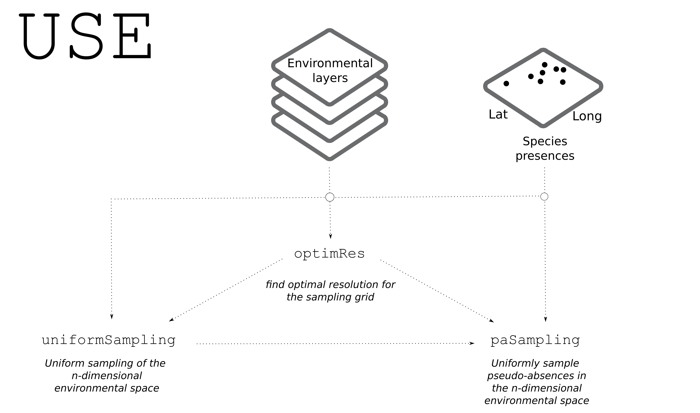

<!-- README.md is generated from README.Rmd. Please edit that file -->

```{r, include = FALSE}
knitr::opts_chunk$set(
  collapse = TRUE,
  comment = "#>",
  fig.path = "man/figures/README-",
  out.width = "100%"
)
```

# USE (Uniform Sampling of the Environmental space)

The `USE` R package offers a collection of functions that enable the uniform sampling of the environmental space. It was specifically developed to assist species distribution modellers in gathering ecologically relevant pseudo-absences by uniformly sampling the environmental space.

<!-- badges: start -->
<!-- badges: end -->

## Installation

The development version of `USE` can be installed running the code below:
```{r, eval=FALSE}
# Install the released version from CRAN
# install.packages("USE") #not available yet
# Or the development version from GitHub:
# install.packages("devtools")
devtools::install_github("danddr/USE")
```

## Package overview
```{r chunk-name, include=FALSE}
knitr::opts_chunk$set(
  fig.path = "man/figures/use_website_figure.png"
)
```



## Examples
Examples showing how to implement `USE` for species distribution modelling are provided in the dedicated vignette, and can also be found at https://github.com/danddr/USE_paper/tree/main/Example.
