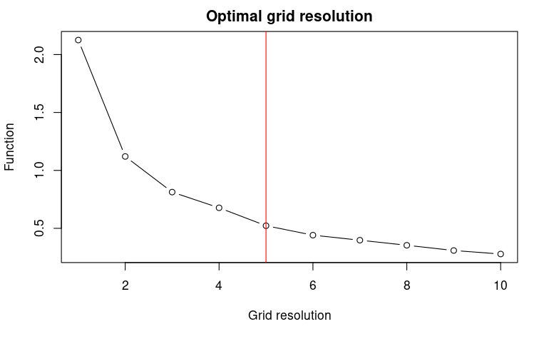

<style type="text/css">
  body{
  font-size: 12pt;
}
</style>

```{r setup, include = FALSE}
knitr::opts_chunk$set(echo = TRUE)
```

This vignette shows the different functionalities, as well as related practical examples, of the `USE` package.

```{r,  eval=TRUE, message=FALSE, echo=TRUE, warning=FALSE, results = FALSE}
library(USE)
library(terra)
library(sf)
library(ggplot2)
```

# 1. Create Virtual Species

First, we download the bioclimatic variables from WorldClim and crop them to the European extent.

```{r, eval=FALSE, message=FALSE}
Worldclim <- geodata::worldclim_global(var='bio', res=10, path=getwd()) 
envData <- terra::crop(Worldclim, terra::ext(-12, 25, 36, 60))
```
```{r, eval=TRUE, echo=FALSE, message=FALSE, results=FALSE}
envData <- USE::Worldclim_tmp
envData <- terra::rast(envData,  type="xyz")
```

Then, we generate the probability of a virtual species presence through the `spatialProba` function available in `USE`. The function allows defining both linear and nonlinear predictor effects in an additive manner, capturing their influence on the log-odds of an event's probability within the framework of logistic regression. Only the bioclimatic variables *bio1* (mean annual temperature) and *bio12* (total annual precipitation) will be used in this example.

We define the probability of occurrence of the virtual species as follows: 

 $logit(\pi) = α  + β_{tm} \cdot temperature  +  β_{tmq} \cdot temperature^2 + β_{pr} \cdot precipitation$
 
where $logit(∙)$ is the natural logarithm of the odds $\pi /(1-\pi )$, $α$ is the model intercept, $β_{tm}$ is the regression parameter for the linear term of temperature, $β_{tmq}$ is the quadratic term for temperature, and , $β_{pr}$ is the parameter for precipitation. Adding a quadratic term for temperature allowed the simulation of an unimodal response of the species to temperature. The argument `coefs` of the `SpatialProba` function requires a (numeric) vector with the values of the parameters that will be used to compute the probabilities of species presence

```{r, eval=TRUE, message=FALSE, warning=FALSE, fig.height = 8, fig.width = 8, fig.align='center'}
myCoef <- c(-8, 1.7, -0.1, -0.001) #0.001
names(myCoef) <- c("intercept", "bio1", "quad_bio1", "bio12" )
myVS.po <- USE::SpatialProba(coefs = myCoef,
                             env.rast = envData, 
                             quadr_term = "bio1",
                             marginalPlots = TRUE)
myVS.po$plot
```

We can now convert the species probability of presence (p) into a binary presence/absence layer, thereby mapping the species distribution into the geographical space. In particular, at each cell of the probability layer, we draw a random realisation of a Bernoulli trial with probability $\pi$. Deriving presence/absence through the random draw from the Bernoulli distribution avoided selecting a fixed, arbitrary threshold to derive the presence/absence layer.

```{r, eval=TRUE, message=FALSE, warning=FALSE, fig.height = 8, fig.width = 8, fig.align='center'}
# Convert the probability of occurrence raster to a raster of presence-absenceusing a random binomial draw
new.pres <- terra::app(myVS.po$rast, fun = function(x) {replicate(1, rbinom(n = length(x), 1, x))})

#Sample true occurrences and true absences using a stratified sampling, keeping a sample prevalence fixed to 1
set.seed(123)
myVS.pa <- terra::spatSample(new.pres, 150, "stratified", xy=TRUE)
names(myVS.pa) <- c("x", "y", "Observed")
```

```{r, eval=TRUE, message=FALSE, warning=FALSE, fig.height = 8, fig.width = 8, fig.align='center'}
ggplot()+
  tidyterra::geom_spatraster(data = new.pres)+
  tidyterra::scale_fill_whitebox_c("deep", direction=1, na.value = "transparent",
                                   breaks=c(0,1)) +
  geom_point(data=myVS.pa, 
             aes(x=x, y=y, color=as.factor(Observed)),
             alpha=1, size=2, shape= 19)+
     scale_colour_manual(name=NULL,
                        values=c("1"='steelblue',"0"='#A41616'))+
  labs(x="Longitude", 
       y="Latitude", 
       fill="Virtual species",
       colour = "Presence/Absence")+
  theme_light()+
  theme(legend.position = "bottom",  
        legend.background=element_blank(),
        legend.box="vertical",
        panel.grid = element_blank(),
        text = element_text(size=14),  
        legend.text=element_text(size=14), 
        aspect.ratio = 1, 
        panel.spacing.y = unit(2, "lines"))
```

Generate a presence-only data set.

```{r, eval=TRUE}
myPres <- subset(myVS.pa, myVS.pa$Observed==1)
myPres <- st_as_sf(myPres , coords=c("x", "y"), crs=4326)
```

# 2. Generating the environmental space

First, the environmental space is generated by performing a principal component analysis (PCA) on a raster stack that includes the selected spatial environmental layers (such as precipitation and temperature). In practice, the PCA operates on the values of the environmental conditions linked to the pixels of the spatial environmental layers. Next, the first two principal components are extracted from the PCA to create a two-dimensional environmental space (it's important to note that the current version of USE only supports uniform sampling in two dimensions). 

Once the two principal components are obtained, a new "spatial object" is created, with the PC-scores (which represent the projection of the environmental pixels within the two-dimensional space) serving as the object's coordinates. This object is then scanned systematically to gather pseudo-absences. It's worth mentioning that, at this stage, all PC-scores, except those associated with the presence of the virtual species, are considered potential pseudo-absences.

The function `USE::optimRes` can be used to find the optimal resolution (i.e., the one providing the best trade-off between a fine resolution and the overfitting of the environmental space) of the sampling grid that will be used to collect the pseudo-absences within the environmental space (see below).

```{r, eval=TRUE}
rpc <- rastPCA(envData, stand = TRUE)
dt <- na.omit(as.data.frame(rpc$PCs[[c("PC1", "PC2")]], xy = TRUE))
dt <- sf::st_as_sf(dt, coords = c("PC1", "PC2"))
```

```{r, eval=FALSE, echo=TRUE}
myRes <- USE::optimRes(sdf=dt,
                    grid.res=c(1:10),
                    perc.thr = 20,
                    showOpt = FALSE, 
                    cr=5)
```



```{r, eval=TRUE, echo=FALSE, message=FALSE, results="hide"}
myRes <- list()
myRes$Opt_res <- 5
```
```{r, eval=TRUE}
myRes$Opt_res
```
# 3. Uniform sampling of the environmental space

To provide a clear example, the function `USE::uniformSampling` is utilized below to systematically search through the environmental space and gather a specific number of observations from each cell within the sampling grid. The resolution of this grid was determined beforehand using the `USE::optimRes` function. It's important to note that in the given example, both the presences and pseudo-absences of the virtual species are potentially sampled by the `USE::uniformSampling` function, as the main purpose is to demonstrate its operation. In the subsequent section, the `USE::uniformSampling` function will be internally called by `USE::paSampling`, exclusively focusing on sampling pseudo-absences.

```{r, eval=TRUE, message=FALSE}
myObs <- USE::uniformSampling(sdf=dt, 
                              grid.res=myRes$Opt_res,
                              n.tr = 5,
                              sub.ts = TRUE,
                              n.ts = 2,
                              plot_proc = FALSE)
```

Have a look at the observations sampled using `USE::uniformSampling`

```{r, eval=TRUE}
head(myObs$obs.tr)
```

Visualizing the coordinates (PC-scores) of the observations sampled in the environmental space using `USE::uniformSampling` demonstrates the effectiveness of uniformly sampling the environmental space. This approach enables the collection of data that accurately represents the entire range of environmental gradients. Moreover, it mitigates the influence of "sample location bias," which arises from randomly sampling observations in the geographical space and often results in an overrepresentation of the most frequently encountered environmental conditions. Uniform sampling mitigates the adverse impact of sample location bias, leading to a more comprehensive understanding of environmental variations.

```{r, eval=TRUE, message=FALSE, warning=FALSE, fig.height = 6, fig.width = 6, fig.align='center'}
env_pca <- c(rpc$PCs$PC1, rpc$PCs$PC2)
env_pca <- na.omit(as.data.frame(env_pca))

ggplot(env_pca, aes(x=PC1))+
  geom_density(aes(color="Environment"), linewidth=1 )+
  geom_density(data=data.frame(st_coordinates(myObs$obs.tr)), 
               aes(x=X,  color="Uniform"), linewidth=1)+
  scale_color_manual(name=NULL, 
                     values=c('Environment'='#1E88E5', 'Uniform'='#D81B60'))+     
  labs(y="Density of PC-scores")+
  ylim(0,1)+
  theme_classic()+
  theme(legend.position = "bottom",  
        text = element_text(size=14),  
        legend.text=element_text(size=12))

ggplot(env_pca, aes(x=PC2))+
  geom_density(aes(color="Environment"), linewidth=1 )+
  geom_density(data=data.frame(st_coordinates(myObs$obs.tr)), 
               aes(x=Y,  color="Uniform"), linewidth=1)+
  scale_color_manual(name=NULL, 
                     values=c('Environment'='#1E88E5', 'Uniform'='#D81B60'))+     
  labs(y="Density of PC-scores")+
  ylim(0,1)+
  theme_classic()+
  theme(legend.position = "bottom",  
        text = element_text(size=14),  
        legend.text=element_text(size=12))
```

# 4. Uniform sampling of the pseudo-absences within the environmental space

The `USE::paSampling` function performs the uniform sampling of the pseudo-absences within the environmental space through a 2-step procedure: 

* First, a kernel-based filter is used to exclude from the environmental space observations associated with environmental conditions that are more likely to be suitable for the species. To identify those conditions, the kernel-based filter uses information about the environmental conditions where the species is present (i.e., presence locations). In a nutshell, kernel density estimation is used to derive the probability density function of the observations associated with the presence of the virtual species within the 2-dimensional environmental space. The observations associated with a probability equal to or greater than a given threshold (by default set to 0.75 in `USE::paSampling`) are deemed to feature suitable environmental conditions for the species. All observations within the space characterized by this combination of environmental conditions have therefore to be excluded from the subsequent step, namely the uniform sampling of the pseudo-absences, to reduce the number of false-absences introduced in the dataset used to train (and test) the species distribution model. To this aim, a convex hull is built to delimit the areas identified by the kernel-filter as those potentially featuring suitable conditions for the virtual species, and all observations (i.e., PC-scores) within the convex hull are excluded from the environmental space;

* Second, the environmental space is systematically scanned to uniformly sample the remaining observations, specifically those located outside the convex hull established in the previous step. These sampled observations constitute the set of pseudo-absences employed for training and testing the species distribution model. This second step is carried out with by the `USE::paSampling` function (internally called by `USE::paSampling`). Pseudo-absences are randomly sampled within each cell of the sampling grid mentioned in the previous section.

```{r, eval=TRUE, message=FALSE}
myGrid.psAbs <- USE::paSampling(env.rast=envData,
                                pres=myPres,
                                thres=0.75,
                                H=NULL,
                                grid.res=as.numeric(myRes$Opt_res),
                                n.tr = 5,
                                prev=1,
                                sub.ts=TRUE,
                                n.ts=5,
                                plot_proc=FALSE,
                                verbose=FALSE)
```

Visualizing the coordinates (PC-scores) of the pseudo-absences sampled in the environmental space using `USE::paSampling`

```{r, eval=TRUE, message=FALSE, warning=FALSE, fig.height = 6, fig.width = 6, fig.align='center'}
ggplot(env_pca, aes(x=PC1))+
  geom_density(aes(color="Environment"), linewidth=1 )+
  geom_density(data=data.frame(st_coordinates(myGrid.psAbs$obs.tr)), 
               aes(x=X,  color="Uniform"), linewidth=1)+
  geom_density(data=terra::extract(c(rpc$PCs$PC1, rpc$PCs$PC2), myPres, df=TRUE), 
               aes(x=PC1, color="Presence"), linewidth=1 )+
  scale_color_manual(name=NULL, 
                     values=c('Environment'='#1E88E5', 'Uniform'='#D81B60', "Presence"="black"))+     
  labs(y="Density of PC-scores")+
  ylim(0,1)+
  theme_classic()+
  theme(legend.position = "bottom",  
        text = element_text(size=14),  
        legend.text=element_text(size=12))

ggplot(env_pca, aes(x=PC2))+
  geom_density(aes(color="Environment"), linewidth=1 )+
  geom_density(data=data.frame(st_coordinates(myGrid.psAbs$obs.tr)), 
               aes(x=Y,  color="Uniform"), linewidth=1)+
  geom_density(data=terra::extract(c(rpc$PCs$PC1, rpc$PCs$PC2), myPres, df=TRUE), 
               aes(x=PC2, color="Presence"), linewidth=1 )+
  scale_color_manual(name=NULL, 
                     values=c('Environment'='#1E88E5', 'Uniform'='#D81B60', "Presence"="black"))+     
  labs(y="Density of PC-scores")+
  ylim(0,1)+
  theme_classic()+
  theme(legend.position = "bottom",  
        text = element_text(size=14),  
        legend.text=element_text(size=12))
```

Visualizing the geographic coordinates of the pseudo-absences sampled in the environmental space using `USE::paSampling`

```{r, eval=TRUE, message=FALSE, warning=FALSE, fig.height = 8, fig.width = 8, fig.align='center'}
ggplot()+
  tidyterra::geom_spatraster(data = new.pres)+
  tidyterra::scale_fill_whitebox_c("deep", direction=1, na.value = "transparent",
                                   breaks=c(0,1)) +
  geom_sf(data=myPres, 
          aes(color= "Presences"), 
          alpha=1, size=2, shape= 19)+
  geom_sf(data=st_as_sf(st_drop_geometry(myGrid.psAbs$obs.tr), 
                        coords = c("x","y"), crs=4326), 
          aes(color="Pseudo-absences"), 
          alpha=0.8, size=2, shape = 19 )+
    scale_colour_manual(name=NULL,
                        values=c('Presences'='steelblue','Pseudo-absences'='#A41616'))+
  labs(x="Longitude", 
       y="Latitude", 
       fill="Virtual species")+
  theme_light()+
  theme(legend.position = "bottom",  
        legend.background=element_blank(),
        legend.box="vertical",
        panel.grid = element_blank(),
        text = element_text(size=14),  
        legend.text=element_text(size=14), 
        aspect.ratio = 1, 
        panel.spacing.y = unit(2, "lines"))
```

# 5. Effect of the kernel density threshold on the environmental sub-space sampled to collect pseudo-absences 

Knowing how `USE::paSampling` operates evidences the importance of carefully selecting a meaningful threshold for the kernel density estimation to delimit the environmental sub-space for the uniform sampling. However, visualizing the impact of different threshold selections can be challenging. To address this, we have incorporated the `USE::thresh.inspect` function. This function generates plots that depict the entire environmental space alongside the portion that would be excluded based on a specific kernel density threshold.

By experimenting with various threshold values, users can observe how each selection affects the delineated area for collecting pseudo-absences. In general, opting for a lower threshold value leads to the exclusion of a larger portion of the environmental space. By allowing users to freely determine the threshold value for the kernel-based filter, `USE` enables the handling of pseudo-absence sampling under diverse ecological scenarios, such as those involving generalist or specialist species or sink populations.

```{r, eval=TRUE, message=FALSE, warning=FALSE, fig.height = 6, fig.width = 9, fig.align='center'}
USE::thresh.inspect(env.rast=envData,
                    pres=myPres,
                    thres=c(0.1, 0.25, 0.5, 0.75, 0.9),
                    H=NULL
                    )
```
